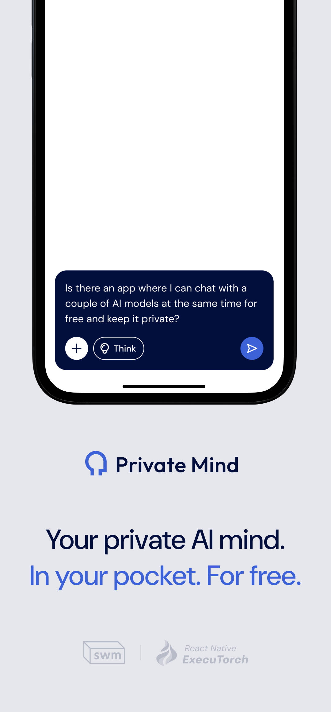
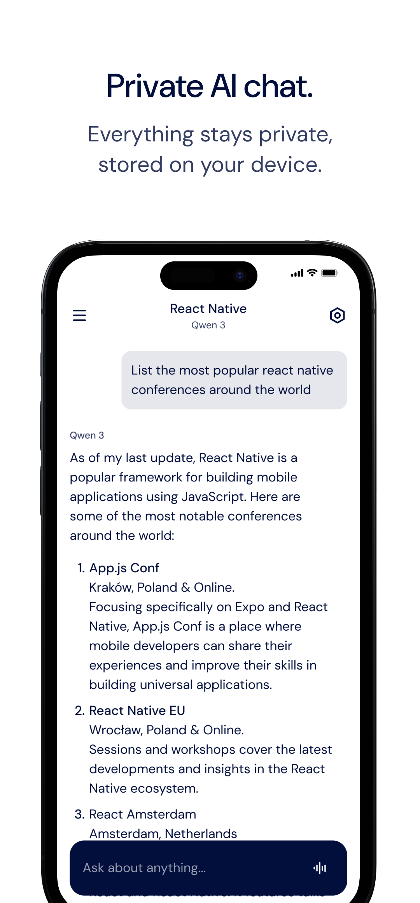
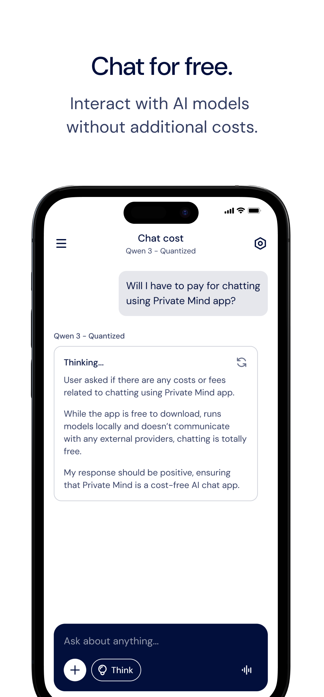

# StudentsAI


StudentsAI represents a new era of AI—powerful, personal, and completely offline. Built around the belief that AI should live entirely on your device, StudentsAI opens the door to a new kind of experience: fast, secure, and fully private.

All conversations happen locally, with no data sent to the cloud and no internet connection required. There are no sign-ups, no subscriptions, and no hidden costs—just intelligent, customisable AI available anytime, anywhere.

## Key Features

- **Fully Private & Secure**: All conversations and data stay on your device. Nothing is collected or shared.
- **Free & Accessible**: Use advanced AI models without subscriptions, accounts, or paywalls.
- **Customizable AI**: Choose from supported models or upload your own. Tailor system prompts and model behaviour to fit your needs.
- **Built-in Benchmarks**: Test and compare models based on performance, memory use, and speed—optimised for your hardware.
- **Offline by Design**: Every feature works without an internet connection. Download models once, and use them on the go.

## Installation

StudentsAI is available in App Store and Google Play:
- [App Store](https://apps.apple.com/pl/app/private-mind/id6746713439?l=pl)
- [Google Play](https://play.google.com/store/apps/details?id=com.swmansion.studentsai)

<table style="width: 100%; border-collapse: collapse; border: none;">
  <tr>
    <td style="width: 33.33%; border: none; padding: 0;">
      
    </td>
    <td style="width: 33.33%; border: none; padding: 0;">
      
    </td>
    <td style="width: 33.33%; border: none; padding: 0;">
      
    </td>
  </tr>
</table>

## Getting Started

```
git clone https://github.com/software-mansion-labs/students-ai.git
cd students-ai
yarn
yarn expo run:ios | yarn expo run:android
```

## StudentsAI is created by Software Mansion

Since 2012 [Software Mansion](https://swmansion.com) is a software agency with experience in building web and mobile apps. We are Core React Native Contributors and experts in dealing with all kinds of React Native issues. We can help you build your next dream product – [Hire us](https://swmansion.com/contact/projects?utm_source=react-native-executorch&utm_medium=readme).

[](https://swmansion.com)

Copyright 2025, [Software Mansion](https://swmansion.com/)
