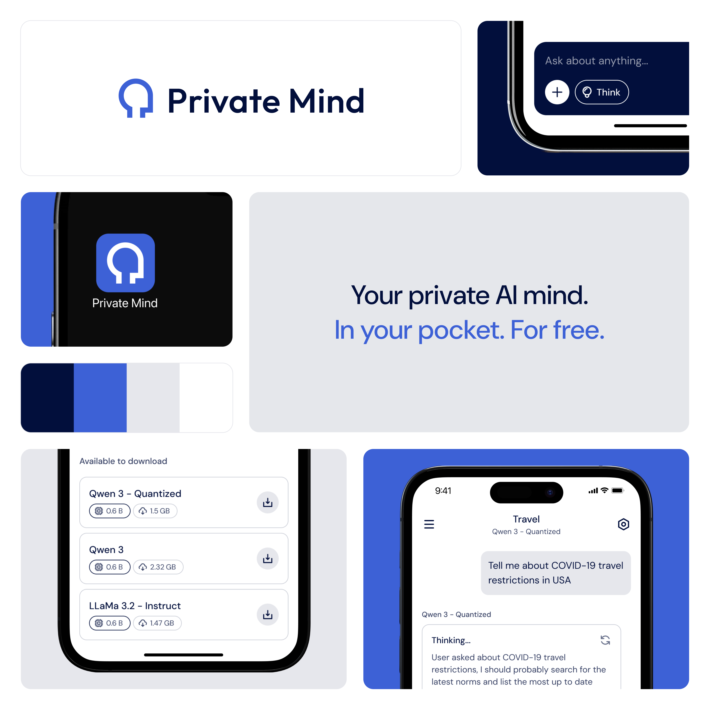
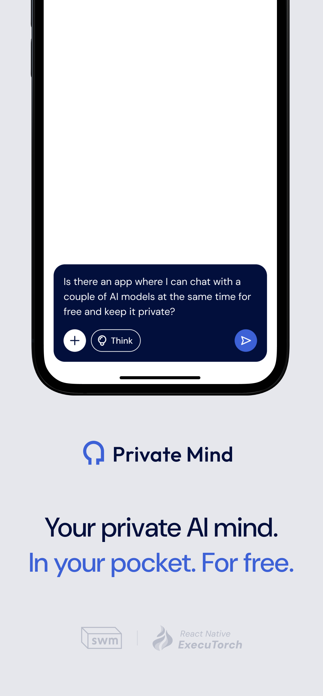
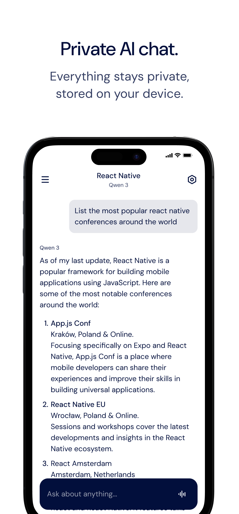
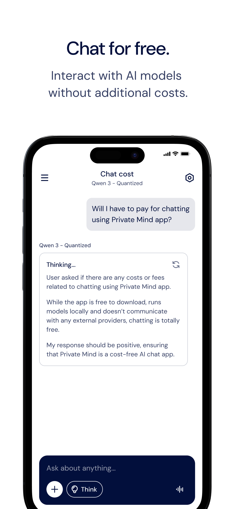

# Private Mind


[](https://swm-delivery.com/www/delivery/ck-slug.php?zoneid=zone-gh-private-mind-1&n=1)
[](https://swm-delivery.com/www/delivery/ck-slug.php?zoneid=zone-gh-private-mind-2&n=1)
[](https://swm-delivery.com/www/delivery/ck-slug.php?zoneid=zone-gh-private-mind-3&n=1)

Private Mind represents a new era of AI—powerful, personal, and completely offline. Built around the belief that AI should live entirely on your device, Private Mind opens the door to a new kind of experience: fast, secure, and fully private.

All conversations happen locally, with no data sent to the cloud and no internet connection required. There are no sign-ups, no subscriptions, and no hidden costs—just intelligent, customizable AI available anytime, anywhere.

## Key Features

- **Fully Private & Secure**: All conversations and data stay on your device. Nothing is collected or shared.
- **Free & Accessible**: Use advanced AI models without subscriptions, accounts, or paywalls.
- **Chat With Your Documents**: Attach a PDF, TXT, Markdown, HTML or CSV file and ask about it. Retrieval and embeddings run on-device, and every answer links back to the passages it came from.
- **Images & Voice**: Send a photo to a vision-capable model, or dictate a message with on-device speech input.
- **Branch Any Conversation**: Fork a chat from any message to explore a different direction without losing the original.
- **Customizable AI**: Choose from supported models or add your own. Save system prompts as reusable presets and tune behavior per chat.
- **Built-in Benchmarks**: Test and compare models on performance, memory use, and speed — measured on your own hardware.
- **Offline by Design**: Once a model is downloaded, every feature works without an internet connection.

## Installation

Private Mind is available in App Store and Google Play:

- [App Store](https://apps.apple.com/pl/app/private-mind/id6746713439?l=pl)
- [Google Play](https://play.google.com/store/apps/details?id=com.swmansion.privatemind)

<table style="width: 100%; border-collapse: collapse; border: none;">
  <tr>
    <td style="width: 33.33%; border: none; padding: 0;">
      
    </td>
    <td style="width: 33.33%; border: none; padding: 0;">
      
    </td>
    <td style="width: 33.33%; border: none; padding: 0;">
      
    </td>
  </tr>
</table>

## Getting Started

You will need Node 20+, Yarn, and the native toolchain for your target — Xcode (iOS 17.0+) or Android Studio.

```bash
git clone https://github.com/software-mansion-labs/private-mind.git
cd private-mind
yarn

yarn ios       # build, install and launch on a simulator or device
yarn android
```

Models are not bundled with the app: they are downloaded from Hugging Face on first use, so the first run needs a network connection. Larger models need a device with enough free memory — the in-app model list marks which ones fit yours.

With a native build already installed, `yarn start` boots just the dev server.

## Private Mind is created by Software Mansion

Since 2012 [Software Mansion](https://swmansion.com) is a software agency with experience in building web and mobile apps. We are Core React Native Contributors and experts in dealing with all kinds of React Native issues. We can help you build your next dream product – [Hire us](https://swmansion.com/contact/projects?utm_source=react-native-executorch&utm_medium=readme).

[](https://swmansion.com)

Copyright 2024–2026, [Software Mansion](https://swmansion.com/)
